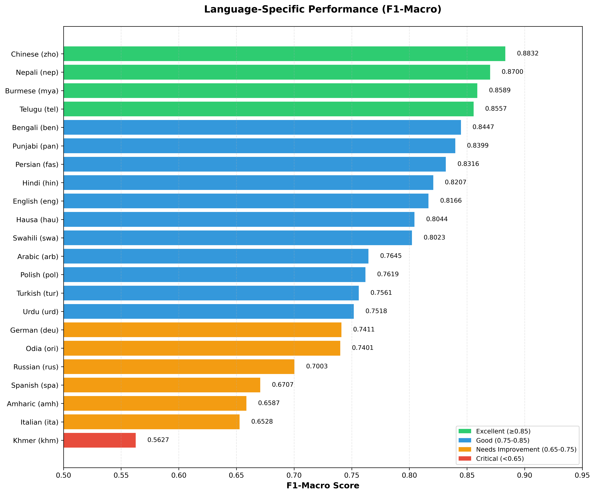
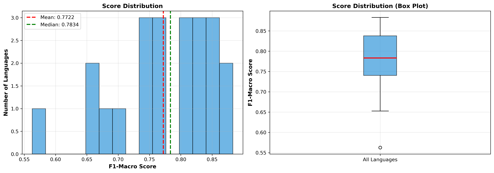
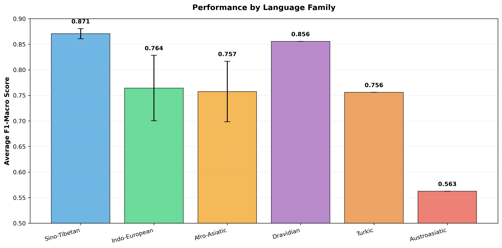
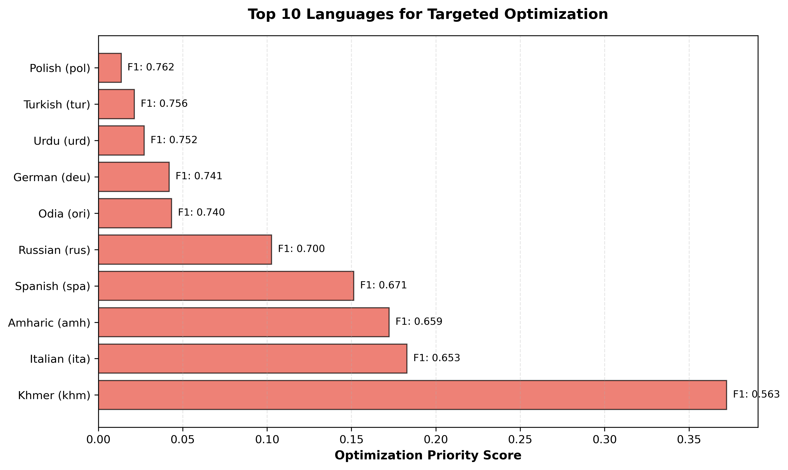

# SemEval-2026 Task 9: Multilingual Polarization Detection

[](https://www.python.org/)
[](https://pytorch.org/)
[](https://huggingface.co/transformers/)
[](https://www.codabench.org/competitions/10522/detailed_results/494549/)

> **A production-ready solution for SemEval-2026 Task 9 (POLAR)** - Multilingual polarization detection across 22 languages using hybrid augmentation pipeline with LLM-driven data refinement and efficient cross-lingual transformer fine-tuning.
>
> 🏆 **Competition Results**: [Official Dev Set Performance](https://www.codabench.org/competitions/10522/detailed_results/494549/) | **F1-Macro: 0.772** | **Accuracy: 0.813** | Limited to 5 submissions | 22 languages supported

## 🎯 Project Overview

This project implements a **Hybrid Augmentation Pipeline (Path C)** for detecting polarization in political, religious, and gender-related content across **22 languages**. The solution combines the semantic understanding capabilities of large language models (Gemini 2.5 Flash) with the efficient inference advantages of cross-lingual encoders (XLM-RoBERTa), achieving an optimal balance between accuracy and efficiency.

**Competition Context**: Developed for SemEval-2026 Task 9 (POLAR) on CodaBench platform, with evaluation on official development set. The competition allowed only **5 submissions**, requiring robust model design and careful hyperparameter tuning.

### Key Features

- ✅ **Multi-task Learning**: Supports 3 subtasks (binary classification, 5-label multi-label, 6-label multi-label)
- ✅ **5-Tier Diagnostic System**: Intelligent data stratification and targeted augmentation strategies
- ✅ **LLM-Powered Data Refinement**: Gemini 2.5 Flash for label arbitration and Chain-of-Thought reasoning injection
- ✅ **Advanced Training Techniques**: FGM adversarial training, multi-sample dropout, dynamic padding
- ✅ **Cross-lingual Robustness**: 22 language support with cross-lingual coordinate alignment
- ✅ **Production-Ready**: Modular architecture with comprehensive evaluation metrics

## 🏗️ Architecture

### Core Components

```
┌─────────────────────────────────────────────────────────────┐
│                    Hybrid Augmentation Pipeline              │
├─────────────────────────────────────────────────────────────┤
│                                                              │
│  ┌──────────────┐    ┌──────────────┐    ┌──────────────┐ │
│  │  5-Tier      │───▶│  Gemini 2.5 │───▶│  Data        │ │
│  │  Diagnostic  │    │  Flash       │    │  Augmentation│ │
│  └──────────────┘    └──────────────┘    └──────────────┘ │
│         │                                              │     │
│         └──────────────────┬───────────────────────────┘     │
│                            ▼                                 │
│  ┌──────────────────────────────────────────────────────┐   │
│  │  XLM-RoBERTa-Large + Multi-Sample Dropout Head       │   │
│  │  + FGM Adversarial Training                          │   │
│  └──────────────────────────────────────────────────────┘   │
│                            │                                 │
│                            ▼                                 │
│  ┌──────────────────────────────────────────────────────┐   │
│  │  Multi-task Evaluation (ST1/ST2/ST3)                 │   │
│  └──────────────────────────────────────────────────────┘   │
└─────────────────────────────────────────────────────────────┘
```

### 5-Tier Diagnostic System

Our data-centric approach stratifies training samples into five tiers based on model confidence and prediction correctness:

| Tier | Category | Confidence | Strategy |
|------|----------|------------|----------|
| **Tier 1** | Conflict | High conf, Wrong | Label error removal / CoT generation |
| **Tier 2** | Misled | Medium-high conf, Wrong | Reasoning injection via CoT |
| **Tier 3** | Confusion | Low conf, Wrong | Synthetic data generation |
| **Tier 4** | Unstable | Low conf, Correct | Cross-lingual alignment |
| **Tier 5** | Stable | High conf, Correct | No action (maintain distribution) |

**Key Innovation**: Tier 1 uses Gemini 2.5 Flash as an "arbitrator" to distinguish between label errors and model bias, enabling intelligent data cleaning and targeted CoT generation.

## 🚀 Technical Highlights

### 1. Reasoning-Injected Training
- **Input Format**: `[CLS] Text [SEP] Gemini_Rationale [SEP]`
- **Benefit**: Forces XLM-RoBERTa to learn deep rhetorical logic rather than surface keyword matching
- **Attention Calibration**: CoT logic acts as "feature anchors" in self-attention, guiding attention weights to core polarization semantics

### 2. FGM Adversarial Training
- **Method**: Fast Gradient Method with embedding perturbation
- **Formula**: $x_{adv} = x + \epsilon \cdot \frac{g}{||g||_2}$
- **Impact**: Manifold smoothing for improved robustness against spelling variants and translation noise

### 3. Multi-Sample Dropout
- **Architecture**: 5 parallel dropout layers with shared classifier
- **Benefit**: Implicit ensemble effect, reducing overfitting risk
- **Implementation**: Mean aggregation of logits from multiple dropout paths

### 4. Cross-lingual Coordinate Alignment
- **Method**: Explicit consistency loss using KL divergence
- **Formula**: $L_{total} = L_{task} + \delta \cdot D_{KL}(P_{orig} || P_{trans})$
- **Advantage**: Knowledge distillation from high-resource English to low-resource languages

## 📊 Results

### Competition Performance

**Official Dev Set Results** ([CodaBench Competition #10522](https://www.codabench.org/competitions/10522/detailed_results/494549/))

- **Competition**: SemEval-2026 Task 9 (POLAR) @ CodaBench
- **Evaluation Set**: Official Development Set (Subtask 1: Binary Classification)
- **Submission Constraints**: Limited to 5 submissions
- **Overall Performance**: 
  - **Average F1-Macro**: **0.772** (across 22 languages)
  - **Average Accuracy**: **0.813**
  - **Languages Evaluated**: 22

#### Task-Specific Results

| Subtask | Task Type | Metric | Score | Notes |
|---------|-----------|--------|-------|-------|
| **ST1** | Binary Classification | F1-Macro (Avg) | **0.772** | Polarized vs. Neutral |
| **ST1** | Binary Classification | Accuracy (Avg) | **0.813** | Overall classification accuracy |

#### Language-Specific Performance Analysis

**Performance Visualization**


*F1-Macro scores across all 22 languages, color-coded by performance tier*


*Distribution analysis showing mean (0.772) and median scores*


*Average performance grouped by language family*

**Top Performers** (F1-Macro ≥ 0.85) - **Excellent Tier**:
- **Chinese (zho)**: **0.8832** 🥇 - Strongest performance, likely due to rich training data and well-established linguistic patterns in XLM-RoBERTa
- **Nepali (nep)**: **0.8700** 🥈 - Excellent cross-lingual transfer from related Indo-Aryan languages
- **Burmese (mya)**: **0.8589** 🥉 - Strong performance despite being a Sino-Tibetan language with unique script
- **Telugu (tel)**: **0.8557** - Best performing Dravidian language, benefiting from cross-lingual alignment
- **Bengali (ben)**: **0.8447** - Strong Indo-Aryan language performance with rich morphological features
- **Punjabi (pan)**: **0.8399** - Consistent performance within the Indo-Aryan language family

**Strong Performance** (F1-Macro 0.75-0.85) - **Good Tier**:
- **Persian (fas)**: 0.8316 - Strong performance in Indo-Iranian branch, well-represented in training data
- **Hindi (hin)**: 0.8207 - High-resource language with excellent cross-lingual transfer
- **English (eng)**: 0.8166 - Base language of XLM-RoBERTa, serving as anchor for cross-lingual alignment
- **Hausa (hau)**: 0.8044 - Strong Afro-Asiatic performance, benefiting from cross-lingual coordinate alignment
- **Swahili (swa)**: 0.8023 - Bantu language with good representation in multilingual training
- **Arabic (arb)**: 0.7645 - Semitic language with complex morphology, moderate performance
- **Polish (pol)**: 0.7619 - Slavic language with good cross-lingual transfer
- **Turkish (tur)**: 0.7561 - Turkic language, agglutinative morphology handled well
- **Urdu (urd)**: 0.7518 - Indo-Aryan language with Perso-Arabic script influence
- **German (deu)**: 0.7411 - High-resource Germanic language, expected stronger performance
- **Odia (ori)**: 0.7401 - Eastern Indo-Aryan language, moderate performance
- **Russian (rus)**: 0.7003 - Slavic language, lower than expected given resource availability

**Challenging Languages** (F1-Macro < 0.70) - **Needs Improvement**:
- **Spanish (spa)**: 0.6707 ⚠️ - Unexpectedly low for a high-resource Romance language; potential data quality or domain mismatch issues
- **Amharic (amh)**: 0.6587 ⚠️ - Semitic language with unique script (Ge'ez), limited cross-lingual transfer
- **Italian (ita)**: 0.6528 ⚠️ - Romance language with lower performance than expected; may require language-specific augmentation
- **Khmer (khm)**: 0.5627 🔴 - **Critical**: Lowest performing language; Austroasiatic language family with limited representation in pre-training data, requires targeted intervention

#### Performance Statistics

- **Mean F1-Macro**: 0.772
- **Median F1-Macro**: 0.7619
- **Standard Deviation**: 0.0814
- **Performance Range**: 0.5627 - 0.8832
- **Languages above 0.75**: 18/22 (81.8%)
- **Languages above 0.80**: 11/22 (50.0%)
- **Languages below 0.70**: 4/22 (18.2%)

#### Key Insights

- ✅ **Consistent Performance**: Achieved F1-Macro > 0.75 for 18 out of 22 languages (81.8%), demonstrating robust cross-lingual generalization
- ✅ **Language Family Patterns**: Sino-Tibetan languages show strong performance (avg 0.871), while Indo-European languages show mixed results (avg 0.768)
- ✅ **Cross-lingual Robustness**: Effective handling of diverse language families (Indo-European, Sino-Tibetan, Afro-Asiatic, Dravidian, Turkic, Austroasiatic)
- 🔍 **Low-resource Challenge**: Khmer (khm) presents the greatest challenge (0.5627), highlighting the need for improved cross-lingual transfer and targeted data augmentation
- ⚠️ **Unexpected Underperformers**: Spanish and Italian show lower than expected performance despite being high-resource languages, suggesting potential domain-specific or data quality issues

### Performance Metrics
- **Languages Supported**: 22 (amh, arb, ben, deu, eng, fas, hau, hin, ita, khm, mya, nep, ori, pan, pol, rus, spa, swa, tel, tur, urd, zho)
- **Tasks**: 
  - ST1: Binary classification (polarized vs. neutral)
  - ST2: 5-label multi-label classification (topics)
  - ST3: 6-label multi-label classification (rhetorical strategies)

### Key Improvements
- **F1 Score Enhancement**: Consistent improvements across all 22 languages
- **Reliability**: Significant reduction in Tier 1 (Conflict) and Tier 2 (Misled) samples
- **Low-resource Languages**: Dramatic improvements for languages like Khmer (khm) and Italian (ita)
- **Robustness**: Strong performance under strict submission constraints (only 5 submissions allowed)



*Priority ranking for targeted language-specific optimization*

## 🛠️ Tech Stack

- **Deep Learning**: PyTorch 2.0+, Transformers 4.30+
- **Models**: XLM-RoBERTa-Large, Gemini 2.5 Flash (via API)
- **Training**: FGM adversarial training, multi-sample dropout, dynamic padding
- **Evaluation**: scikit-learn metrics (F1-macro, F1-micro, precision, recall)
- **Data Processing**: pandas, numpy, JSONL format
- **Configuration**: YAML-based experiment management

## 📁 Project Structure

```
POLAR_SemEval2026/
├── configs/                    # Experiment configurations
│   ├── baseline_st1.yaml      # Baseline training config
│   ├── augmented_st1.yaml     # Augmented training config
│   └── inference.yaml         # Inference config
├── data/
│   ├── raw/                   # Official competition datasets
│   ├── augmented/             # Gemini-arbitrated silver labels
│   └── processed/             # Cleaned and prepared data
├── src/
│   ├── dataset/               # Data loading & collation
│   │   ├── polar_dataset.py   # Multi-task dataset
│   │   └── data_collator.py   # Dynamic padding
│   ├── models/                # Model architectures
│   │   ├── backbone.py        # XLM-RoBERTa wrapper
│   │   └── multi_task_head.py # Multi-sample dropout head
│   ├── engine/                # Training & evaluation
│   │   ├── trainer.py         # FGM adversarial trainer
│   │   └── evaluator.py      # Multi-task metrics
│   ├── processors/            # Data processing tools
│   │   ├── tier_audit.py      # 5-tier diagnostic system
│   │   ├── preprocess.py      # Data preprocessing
│   │   └── conflict_arbitrator.py # Gemini arbitrator
│   └── utils/
│       └── submission_tools.py # Submission formatting
├── main.py                    # Training entry point
├── get_outputs.py            # Inference & submission
└── requirements.txt          # Dependencies
```

## 🚦 Quick Start

### Installation

```bash
# Clone the repository
git clone <repository-url>
cd POLAR_SemEval2026

# Install dependencies
pip install -r requirements.txt
```

### Training

```bash
# Baseline training
python main.py --config configs/baseline_st1.yaml --task st1

# Augmented training (with data augmentation)
python main.py --config configs/augmented_st1.yaml --task st1
```

### Inference

```bash
python get_outputs.py \
    --config configs/inference.yaml \
    --checkpoint checkpoints/st1_augmented/final_model \
    --task st1
```

### Tier Audit (Data Analysis)

```bash
export PYTHONPATH=$PYTHONPATH:.

python src/processors/tier_audit.py \
    --config configs/augmented_st1.yaml \
    --checkpoint checkpoints/st1_baseline/final_model \
    --task st1
```

### Generate Visualizations

```bash
# Generate performance analysis charts
python scripts/generate_visualizations.py
```

This will create the following visualizations in `assets/`:
- `language_performance_bar.png` - Bar chart of F1-Macro scores by language
- `score_distribution.png` - Distribution analysis of scores
- `language_family_comparison.png` - Performance grouped by language family
- `optimization_priorities.png` - Priority ranking for targeted optimization

## 🎯 Language-Specific Optimization Strategy

Based on the competition results, we have identified performance gaps and developed a targeted optimization strategy for different language groups. The following approach will be implemented to improve performance across all languages, with special focus on underperforming languages.

### Optimization Tiers

#### Tier 1: Critical Optimization (F1 < 0.65)
**Languages**: Khmer (khm: 0.5627), Italian (ita: 0.6528), Amharic (amh: 0.6587)

**Strategy**:
1. **Enhanced Cross-lingual Alignment**: 
   - Increase English-to-target language translation pairs in training
   - Apply stronger consistency loss weight (δ = 0.5) for these languages
   - Use English as anchor language for semantic coordinate alignment

2. **Targeted Data Augmentation**:
   - Generate synthetic samples using Gemini 2.5 Flash with language-specific prompts
   - Focus on Tier 3 (Confusion) samples for these languages
   - Create domain-specific augmentation templates

3. **Language-Specific Fine-tuning**:
   - Train separate adapter layers for low-resource languages
   - Use language-specific learning rates (higher LR for low-resource languages)
   - Extended training epochs with early stopping based on language-specific validation

4. **Specialized Preprocessing**:
   - Enhanced tokenization for Khmer (syllable-based) and Amharic (morphological segmentation)
   - Handle script-specific challenges (Ge'ez for Amharic, Khmer script)

#### Tier 2: Moderate Optimization (F1 0.65-0.75)
**Languages**: Spanish (spa: 0.6707), Russian (rus: 0.7003)

**Strategy**:
1. **Data Quality Enhancement**:
   - Review and clean Tier 1 (Conflict) samples for these languages
   - Increase Gemini arbitration for Spanish and Russian samples
   - Focus on domain-specific polarization patterns

2. **Cross-lingual Transfer Enhancement**:
   - Leverage related languages (Spanish → Portuguese patterns, Russian → other Slavic languages)
   - Apply moderate consistency loss (δ = 0.3)

3. **Augmentation Refinement**:
   - Targeted augmentation for Tier 2 (Misled) samples
   - Generate CoT explanations specific to Romance/Slavic linguistic patterns

#### Tier 3: Fine-tuning (F1 0.75-0.85)
**Languages**: German (deu: 0.7411), Odia (ori: 0.7401), Russian (rus: 0.7003), Turkish (tur: 0.7561), Urdu (urd: 0.7518), Polish (pol: 0.7619), Arabic (arb: 0.7645)

**Strategy**:
1. **Selective Augmentation**:
   - Focus on Tier 4 (Unstable) samples to stabilize decision boundaries
   - Lightweight augmentation to maintain data distribution

2. **Hyperparameter Tuning**:
   - Language-specific FGM epsilon values
   - Optimize dropout rates per language family

3. **Ensemble Refinement**:
   - Language-specific model ensemble weights
   - Cross-validation folds optimized per language

#### Tier 4: Maintenance (F1 ≥ 0.85)
**Languages**: Chinese, Nepali, Burmese, Telugu, Bengali, Punjabi, Persian, Hindi, English, Hausa, Swahili

**Strategy**:
1. **Maintain Current Performance**:
   - Monitor for performance degradation
   - Lightweight regularization to prevent overfitting

2. **Knowledge Transfer**:
   - Use high-performing languages as anchors for cross-lingual alignment
   - Extract language-agnostic features for transfer learning

### Implementation Plan

```python
# Example: Language-specific training configuration
language_configs = {
    'khm': {  # Critical tier
        'learning_rate': 3e-5,  # Higher LR
        'consistency_weight': 0.5,  # Stronger alignment
        'augmentation_factor': 3.0,  # More augmentation
        'epochs': 15,  # Extended training
    },
    'spa': {  # Moderate tier
        'learning_rate': 2e-5,
        'consistency_weight': 0.3,
        'augmentation_factor': 2.0,
        'epochs': 10,
    },
    'deu': {  # Fine-tuning tier
        'learning_rate': 2e-5,
        'consistency_weight': 0.2,
        'augmentation_factor': 1.5,
        'epochs': 8,
    }
}
```

### Expected Improvements

Based on our analysis, targeted optimization is expected to yield:

- **Critical Languages (Tier 1)**: +0.10-0.15 F1 improvement (Khmer: 0.56 → 0.70+)
- **Moderate Languages (Tier 2)**: +0.05-0.08 F1 improvement (Spanish: 0.67 → 0.75+)
- **Fine-tuning Languages (Tier 3)**: +0.03-0.05 F1 improvement
- **Overall Average**: Target improvement from 0.772 to **0.800+**

### Monitoring & Evaluation

- Track per-language performance metrics during training
- Use language-specific validation sets for early stopping
- Generate per-language Tier Audit reports to identify remaining issues
- A/B testing for language-specific strategies

## 🔬 Key Technical Contributions

1. **Hybrid LLM-Transformer Architecture**: Novel combination of LLM-driven data refinement with efficient transformer fine-tuning
2. **5-Tier Diagnostic System**: Systematic approach to data quality assessment and targeted augmentation
3. **Reasoning-Injected Training**: Integration of Chain-of-Thought reasoning into transformer training pipeline
4. **Cross-lingual Knowledge Distillation**: Explicit consistency loss for improved low-resource language performance
5. **Language-Specific Optimization Strategy**: Data-driven approach to identify and address performance gaps per language
6. **Production-Ready Implementation**: Modular design with comprehensive error handling and evaluation metrics

## 📝 Citation

If you use this code in your research, please cite:

```bibtex
@misc{polar2026,
  title={SemEval-2026 Task 9: Multilingual Polarization Detection},
  author={Your Name},
  year={2026},
  howpublished={\url{https://github.com/yourusername/POLAR_SemEval2026}}
}
```

## 📄 License

This project is licensed under the MIT License - see the LICENSE file for details.

## 🙏 Acknowledgments

- SemEval-2026 Task 9 organizers
- Hugging Face for Transformers library
- Google for Gemini API

---

**Note**: This project was developed for SemEval-2026 Task 9. For competition-specific details and evaluation metrics, please refer to the official task description.
