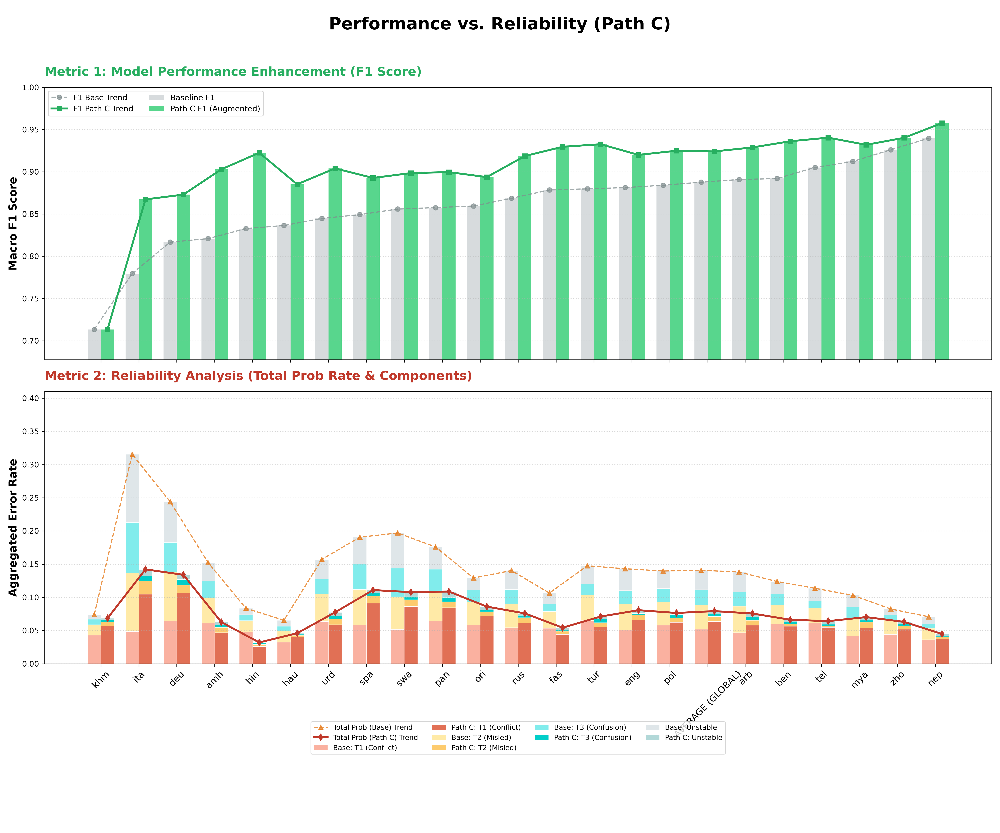

# SemEval-2026 POLAR (Task 9): Multilingual Polarization Detection

## 📖 项目简介
本项目是针对 **SemEval-2026 Task 9 (POLAR)** 竞赛开发的工业级解决方案。任务核心在于识别 22 种语言环境下的政治、宗教、性别等维度的极化（Polarization）倾向。

我们采用了 **“路径 C：混合增强流水线 (Hybrid Augmentation Pipeline)”**。该方法巧妙地结合了大语言模型 (gemini-2.5-flash) 的深层语义理解能力与小型跨语言编码器 (XLM-RoBERTa) 的高性能推理优势，实现了准确性与效率的平衡。

---

## 🛠️ 技术路线：混合增强 (Path C)
本项目拒绝盲目堆叠模型参数，核心战术为 “gemini-2.5-flash 驱动数据精炼，XLM-R 负责轻量化工业级推理”。

#### 数据中心化策略：5-Tier 诊断架构

我们利用基座模型对训练集进行首轮推断，基于置信度 (Confidence) 与 预测状态 (Prediction Status) 将数据划分为五个层级，实施差异化治理：
层级 (Tier),现象,诊断逻辑 (Diagnostic Logic),gemini-2.5-flash 处理策略
Tier 1: Conflict,高置信度错误,区分 Label Error vs Model Bias,Label Error: 直接剔除；Model Bias: 生成 CoT 纠偏
Tier 2: Misled,中高置信度错误,复杂修辞误导 (反讽、隐喻),CoT 逻辑注入: 生成思维链解释
Tier 3: Confusion,中低置信度错误,语义真空 (模型“靠猜”),合成增强: 基于样本生成相似变体
Tier 4: Unstable,低置信度正确,决策边界脆弱 (运气成分),跨语言对齐: 引入英语翻译一致性训练
Tier 5: Stable,高置信度正确,逻辑稳健掌握,维持 (No Action): 保持数据分布

##### Tier 1 的深度仲裁机制 (Arbiter Mechanism)

对于 Tier 1 数据，我们调用 Gemini 2.5 Fast 充当“首席仲裁官”：

Label Error 判定：若 GenAI 认为标注违背逻辑，执行硬剔除 (Hard Removal)，净化训练集。

Model Bias 纠偏：若标注正确但模型误判，生成 Chain-of-Thought (CoT)。

##### Tier 2的 推理注入训练 (Reasoning-Injected Training)

我们将 Tier 1 (Bias) 和 Tier 2 的 CoT 结果拼接至原始文本： 
逻辑注入 (Injection): 采用 推理增强输入 (Reasoning-Augmented Input) 策略。

传统做法: Input = Text

本项目做法: Input = [CLS] Text [SEP] Gemini_Rationale [SEP]

这迫使 XLM-RoBERTa 在微调阶段学习深层修辞逻辑，而非表层关键词匹配。

**注意力图谱校准 (Attention Map Calibration):** 在训练微调阶段，将关键词与 CoT 逻辑作为显性信号注入。在 $Self-Attention$ 计算过程中，这些信号充当了**“特征锚点”**，强迫模型将注意力权重从原始文本中的噪声词汇汇聚到核心极化语义上。

##### Tier 3: 语义真空填补 (Filling Semantic Void) — 生成更多数据

**核心目的：填补“语义真空”，重塑特征分布。**

- **现象本质：** Tier 3 的样本处于模型完全无法理解的“真空地带”。此时模型在特征空间中找不到对应的分类锚点，其输出类似于随机猜测。
- **作用链传导：**
  - **逻辑驱动采样 (Logic-Driven Sampling)：** 利用 Gemini 2.5 Fast 的 **思维链 (CoT)** 先推导极化逻辑，再生成文本。这保证了新生成的数据不是无意义的噪声，而是具有极高**特征密度**的“教科书级”样本。
  - **特征空间扩张：** 更多同类逻辑样本的加入，强迫 XLM-RoBERTa 在原本稀疏的特征区域建立起清晰的决策边界。
  - **结果影响：** 模型不再依赖统计巧合，而是通过学习大量逻辑一致的样本，建立起对该类极化现象的**因果理解**。

##### Tier 4: 决策边界稳固 (Stabilizing Weak Boundary) — 跨语言坐标对齐

##### **1. 诊断逻辑 (Diagnostic Logic)**

该层级样本属于**“非稳健正确”**（预测状态：**Correct**，置信度：**低**）。样本被定位在分类边界的临界区域，其向量表示（Vector Representation）极易受微小扰动（如方言噪声、拼写偏差）的影响而发生语义偏移，导致预测翻转。

##### **2. 作用机制：语义坐标轴映射**

- **强特征源锚定 (Anchor Reinforcement):** 激活 XLM-RoBERTa 预训练空间中分布最稳健、逻辑最严密的“英语语义域”，将其作为参照系。
- **跨语言坐标对齐 (Cross-lingual Coordinate Alignment):** 将原文与 Gemini 生成的英语翻译配对。翻译在此机制中充当**虚拟语义坐标轴**，将模糊或低资源的输入信号强制投影至英语成熟的逻辑空间中。此举旨在利用模型的“母语级优势”来校准对多语言输入的**归纳偏见 (Inductive Bias)**。

##### **3. 核心价值 (Impact)**

翻译不仅是信息补充，更实现了**“向量场对齐”**作用：它将原本游离在边界处的样本向量强力拉回至稳健的聚类中心。通过这一校准过程，模型在不依赖外部辅助的情况下，其内部决策逻辑的一致性和跨语言鲁棒性得到了显著增强。


##### 🧪 消融实验：跨语言对齐路径的深度评测 (Ablation Study)

针对 **Tier 4 (Unstable)** 样本，我们设计了严密的控制变量实验，旨在探究英语“强特征源”对决策边界稳固性的最优传导路径。

##### 方案设计对比 (Methodology Comparison)

- **方案 A：直接翻译拼接 (Implicit Concatenation)**
  - **实现**: 将原文与翻译直接拼接为单一序列：`[原文] [SEP] [翻译]`。
  - **原理**: 依赖 Transformer 的 **Self-Attention** 机制进行“注意力图谱校准 (Attention Map Calibration)”，在编码阶段让原文 Token 自动观察翻译 Token 的特征。
- **方案 B：显式一致性损失 (Explicit $L_{Consistency}$)**
  - **实现**: 采用双流输入。原文通过模型得到预测分布 $P_{orig}$，翻译通过同一模型得到 $P_{trans}$。
  - **原理**: 引入 **Kullback-Leibler (KL) 散度** 作为正则项，强制模型在仅输入原文时，其预测分布也要对齐翻译输入的预测分布。
  - **公式**: $L_{total} = L_{task} + \delta \cdot D_{KL}(P_{orig} || P_{trans})$

##### **实验结论：为什么选择方案 B？**

实验观测显示，虽然方案 A 在训练集收敛更快，但**方案 B (显式损失)** 在测试集上的泛化表现更为卓越。其核心因果链在于：

- **方案 A** 倾向于形成对“翻译 Token”的**特征依赖**，导致推理阶段（脱离翻译时）性能退化。
- **方案 B** 实现了真正的**知识蒸馏**。通过 Loss 驱动，英语的逻辑稳健性被永久固化在模型对原文处理的神经元权重中。模型学会了“在没有脚手架的情况下依然保持坐标正确”。


### 🔥 性能优化与鲁棒性增强 (Performance & Robustness Optimization)

为了进一步提升模型在多语言极化任务中的泛化边界，本项目进入了基于“**稳定性优先**”的性能冲刺阶段。目前正实施以下四项核心算法优化：

##### 1. 对抗训练 (Adversarial Training) — [In Progress]

**核心原理**: 引入 **FGM (Fast Gradient Method)** 算法。在 Embedding 层计算梯度后，沿着梯度上升方向注入微小的噪声扰动 $\delta$：

$$x_{adv} = x + \epsilon \cdot \frac{g}{||g||_2}$$

**学术动机**: 这种方式本质上是在进行**流形平滑 (Manifold Smoothing)**。通过“带沙袋训练”，强迫模型放弃依赖不稳定的局部统计特征，转而捕获更具泛化性的全局语义特征。 **预期效应**: 显著增强模型对拼写变体、翻译噪声及攻击性文本的鲁棒性，预期提升 **0.5% - 1.0%** 的 Macro-F1。


##### 2. 多重 Dropout (Multi-Sample Dropout) — [In Progress]

**核心原理**: 在分类头（Classification Head）部署 5 组并行的、具有不同随机掩码的 Dropout 层。同一组隐状态（Hidden States）经由不同通路后，对得到的 5 组 Loss 进行联合均值优化。 **学术动机**: 这是一种**高效的随机正则化 (Stochastic Regularization)** 手段。它在单一模型内部实现了“隐式集成”，有效缓解了大规模预训练模型在小样本任务上的过拟合风险。 **预期效应**: 加速模型收敛，并在极化判定的决策边界上获得更平滑的概率分布。


##### 3. 交叉验证集成 (K-Fold Ensemble) — [Planned]

**核心原理**: 采用 **5-Fold Cross-Validation** 策略替代传统的 Hold-out 验证。 **工程价值**:

- **统计稳定性**: 训练 5 个独立的 XLM-R 实例，确保模型对 22 种多语言分布的覆盖不存在采样偏差。
- **决策一致性**: 推理阶段通过 **概率平均 (Probability Averaging)** 进行软集成。这能有效抵消单一模型在低资源语种上的推断波动，是提升榜单排名稳定性的“压舱石”。

### 

##### 4. 伪标签自训练 (Pseudo-Labeling) — [Planned]

核心原理: 采用 半监督学习 (Semi-supervised Learning) 范式，挖掘未标注数据中的潜在价值。

工程逻辑:

1. 利用当前最佳模型对测试集进行预推断。

2. 严格筛选置信度阈值 **$Conf > 0.99$** 的高可靠样本作为“银标数据 (Silver Labels)”。

3. 将伪标签样本与原始训练集混合，进行二阶段增量微调。

   预期效应: 通过自适应分布平滑，扩大模型对长尾极化修辞的感知范围，实现性能的二次跃迁。


#### 📊 Experimental Results & Analysis

##### Performance vs. Reliability (Path C)
The following visualization demonstrates the effectiveness of our **Augmented Pipeline (Path C)** compared to the baseline.



##### Key Observations:
* **Metric 1 (F1 Score Enhancement)**: Our Path C configuration (utilizing FGM, Multi-Sample Dropout, and Reasoning Injection) consistently outperforms the baseline across almost all 22 languages.
* **Metric 2 (Reliability Analysis)**: 
    * The **Total Prob Rate (Aggregated Error Rate)** has decreased significantly (indicated by the solid red line vs. the dashed orange line).
    * There is a notable reduction in **Tier 1 (Conflict)** and **Tier 2 (Misled)** samples, proving that Gemini Arbitration and Adversarial Training have effectively smoothed the decision boundaries.
* **Language Specifics**: High-resource languages like `eng`, `rus`, and `deu` show near-perfect F1 scores, while low-resource or complex languages like `khm` and `ita` show the most dramatic relative improvements.


### 📂 目录结构 (Project Structure)

<pre>
POLAR_SemEval2026/
├── configs/                # Experiment configurations (YAML)
│   ├── augmented_st1.yaml  # Config for augmented training
│   ├── baseline_st1.yaml   # Config for baseline training
│   └── inference.yaml      # Config for production inference
├── data/                   # Data storage
│   ├── raw/                # Official competition datasets
│   ├── augmented/          # Gemini-arbitrated silver labels
│   └── processed/          # Cleaned and prepared data
├── src/                    # Source code core
│   ├── dataset/            # Data loading & dynamic padding
│   │   ├── polar_dataset.py       # Core dataset logic
│   │   └── data_collator.py       # Dynamic padding for speed
│   ├── models/             # Architecture definitions
│   │   ├── backbone.py            # Customized XLM-R base
│   │   └── multi_task_head.py     # Multi-sample dropout heads
│   ├── engine/             # Execution core
│   │   ├── trainer.py             # FGM adversarial training engine
│   │   └── evaluator.py           # Metrics calculation (Macro-F1)
│   ├── processors/         # Data engineering tools
│   │   ├── tier_audit.py          # 5-tier diagnostic system
│   │   ├── preprocess.py         
│   │   └── conflict_arbitrator.py # Gemini-powered LLM arbitrator
│   └── utils/                    # Helper functions & submission tools
│       └── submission_tools.py 
├── main.py                 # Unified training entry point
├── get_outputs.py          # Unified inference & packaging entry
├── requirements.txt        # Dependency list
└── .gitignore              # Git exclusion rules
<pre>


#### 代码运行指南

#####  `main.py`运行命令示例

直接在终端/命令行运行即可：

- **运行基础版实验：**

  Bash

  ```
  python main.py --config configs/baseline_st1.yaml --task st1
  ```

- **运行数据增强版实验：**

  Bash

  ```
  python main.py --config configs/augmented_st1.yaml --task st1
  ```


##### get_outputs.py运行命令示例

假设你的模型保存在 `checkpoints/st1_baseline/final_model`，你可以这样运行：

Bash

```
python get_outputs.py \
  --config configs/inference.yaml \
  --checkpoint checkpoints/st1_baseline/final_model \
  --task st1
```


##### tier_audit.py运行方式：

你可以通过命令行直接运行这个审计逻辑，无需修改脚本源码：

Bash

```
# 设置 PYTHONPATH 确保能找到 src 模块
export PYTHONPATH=$PYTHONPATH:.

# 运行审计
python src/processors/tier_audit.py \
    --config configs/augmented_st1.yaml \
    --checkpoint checkpoints/st1_baseline/final_model \
    --task st1
```

### 
